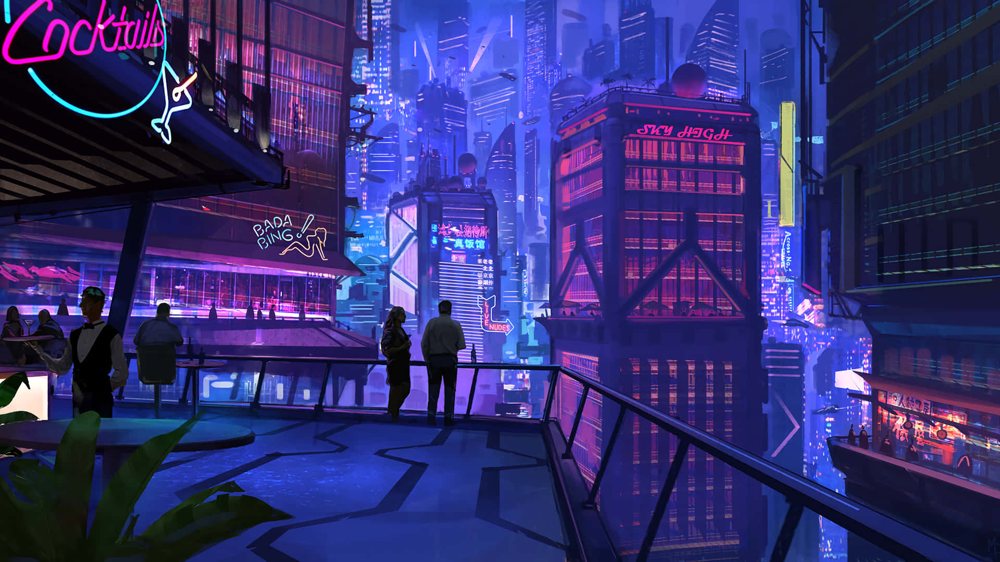

# NEON VIDEO RIPPER 🌟

A cyberpunk-themed YouTube video downloader with a sleek, neon-infused interface inspired by Cyberpunk 2077. Download your favorite videos in style!



## 🚀 Features

- **Cyberpunk UI**: Immersive neon-themed interface with glitch effects and terminal-style design
- **Multiple Resolutions**: Choose from various video quality options
- **Real-time Progress**: Live download progress with speed and ETA
- **Cancel Anytime**: Abort downloads with a single click
- **Responsive Design**: Works seamlessly on all devices

## 🛠️ Installation

1. Clone the repository:
```bash
git clone https://github.com/EloneMusk/NEON-VIDEO-RIPPER
cd Trae
```

2. Install required packages:
```bash
pip install -r requirements.txt
```

## 🎮 Usage

1. Start the application:
```bash
python app.py
```

2. Open your browser and navigate to `http://localhost:5000`
3. Paste a YouTube URL
4. Select your desired resolution
5. Click "EXECUTE DOWNLOAD"

## 🌐 Tech Stack

- **Backend**: Python with Flask
- **Frontend**: HTML, CSS, JavaScript
- **Video Processing**: youtube-dlp
- **Real-time Updates**: Socket.IO

## 🎨 Interface

### Main Features
- Neon-glowing buttons and inputs
- Real-time download progress bar
- Terminal-style interface
- Glitch effects on text
- Cyberpunk color scheme

## 🔒 Security & Error Handling

- Input validation for URLs
- Secure file handling
- Graceful error messages for invalid URLs
- Download cancellation support
- Progress tracking with detailed status updates

## 📝 License

This project is open source and available under the MIT License.

---

<p align="center">Made with 💻 in the dark future of 2077</p>
